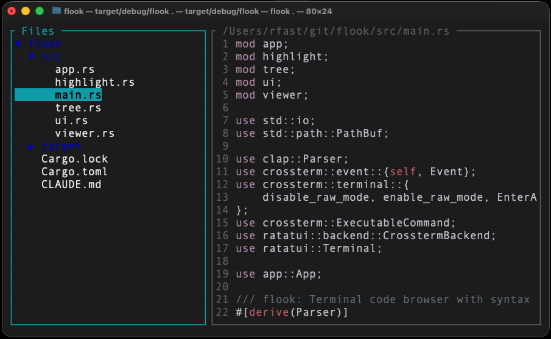

# flook 👀

> A blazingly fast terminal file browser for the AI-assisted coding era



## Why flook?

Let's be honest: if you're using Claude Code, Cursor, Aider, or any other CLI-based agentic coding tool, **do you really need a full IDE anymore?** The AI writes the code. You review it. You ask for changes. Rinse and repeat.

But here's the thing - you still want to **watch what's happening**. You want to peek at that file the agent just modified. You want to browse the tree to see if it created the right structure. You want to quickly jump between files without the bloat of VSCode spinning up or the complexity of configuring vim plugins.

**Enter flook.** A minimal, keyboard-driven file browser that does exactly one thing well: let you browse and read code in your terminal, right alongside your AI assistant.

## Features

- **Two-panel interface**: File tree on the left, code viewer on the right
- **Syntax highlighting**: Powered by syntect, supports tons of languages out of the box
- **Fast**: Pre-highlights files on load. Written in Rust. No bloat.
- **Vim keybindings**: Because of course it does (j/k navigation, g/G for top/bottom)
- **Smart binary detection**: Won't try to display your compiled artifacts
- **Zero configuration**: Just run it. It works.
- **Terminal native**: Fits perfectly in your AI-coding workflow

## Installation

### From releases

Download the latest binary for your platform from the [releases page](https://github.com/rfast/flook/releases).

### From source

```bash
cargo install --path .
```

Or just clone and build:

```bash
git clone https://github.com/rfast/flook
cd flook
cargo build --release
./target/release/flook
```

## Usage

```bash
# Browse current directory
flook

# Browse specific directory
flook /path/to/project

# Open directly to a file
flook src/main.rs
```

## Keybindings

### Navigation
- `j`/`k` or `↓`/`↑` - Move up/down in tree or scroll code
- `Tab` - Switch between file tree and code viewer
- `Enter` - Expand/collapse directory or open file
- `PageUp`/`PageDown` - Scroll code viewer by 20 lines
- `g` or `Home` - Jump to top of file
- `G` or `End` - Jump to bottom of file

### Quit
- `q` or `Ctrl-C` - Exit flook

## The Philosophy

Modern AI coding tools are incredible, but they've created a workflow gap. You don't need an IDE's autocomplete, LSP servers, or debugging tools when the AI is writing the code. But you **do** need to see what's happening.

flook fills that gap. It's:

- **Lightweight**: Starts instantly, uses minimal resources
- **Unobtrusive**: Sits quietly in a terminal pane while your agent works
- **Focused**: Does one thing (browsing code) extremely well
- **Terminal-first**: Designed for the keyboard-driven, multiplexed-terminal workflow

## Use Cases

- **AI pair programming**: Keep flook open in a tmux pane while chatting with Claude Code
- **Quick code review**: Browse through changes without opening a full editor
- **Project exploration**: Get familiar with a new codebase structure
- **Teaching/demos**: Show code structure without IDE complexity
- **SSH sessions**: Browse remote code when you can't (or don't want to) use a GUI

## Technical Details

Built with:
- [ratatui](https://github.com/ratatui-org/ratatui) - Terminal UI framework
- [syntect](https://github.com/trishume/syntect) - Syntax highlighting
- [crossterm](https://github.com/crossterm-rs/crossterm) - Terminal manipulation
- Pure Rust goodness

## Contributing

PRs welcome! The codebase is intentionally small and well-documented. Check out `CLAUDE.md` for architecture details if you want to hack on it.

## License

MIT

## Credits

Created by someone who got tired of fighting with IDE configurations when an AI is writing 90% of the code anyway.

---

*"The best tool is the one that gets out of your way."*
